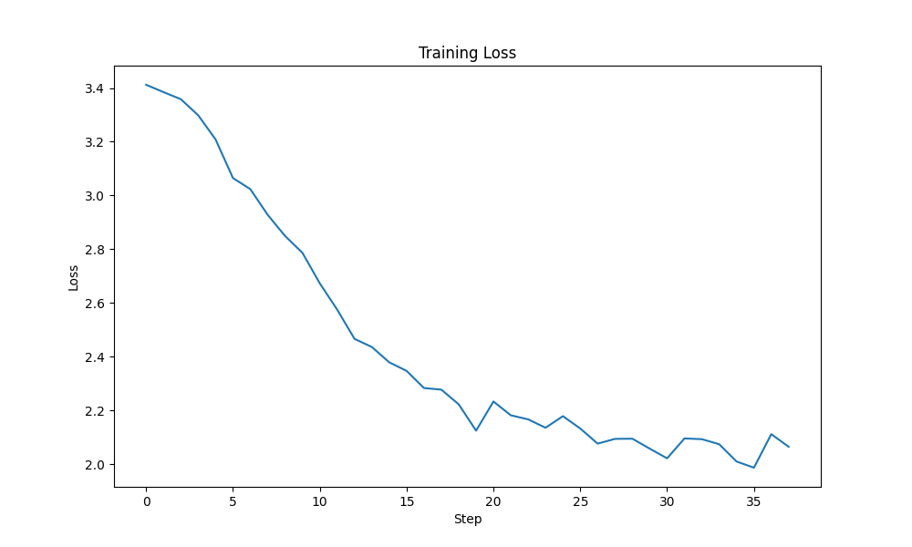
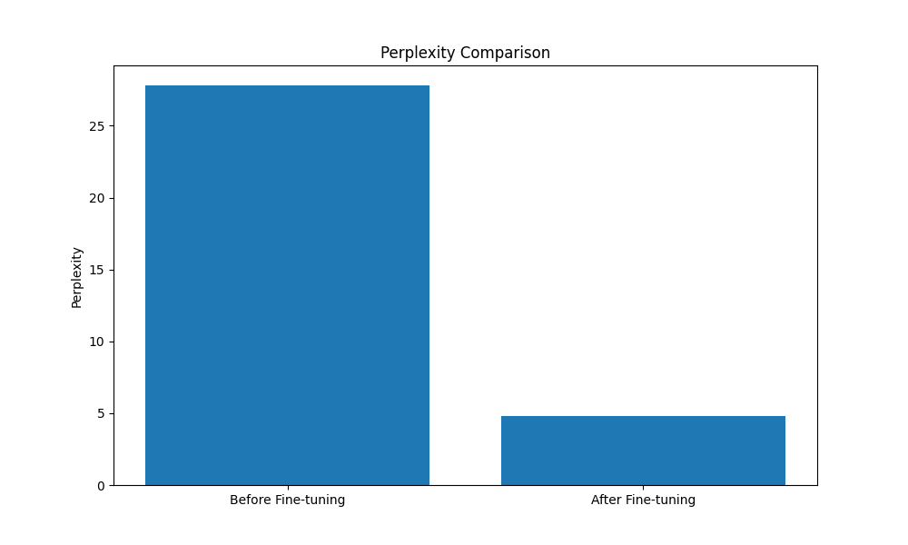

# Medical Language Model Fine-Tuning and Evaluation

## Overview

This project demonstrates the process of fine-tuning a GPT-2 language model on medical data and evaluating its performance on specific medical topics. The implementation includes model training, perplexity evaluation, text generation, and result visualization. The main goal was to take a small model like GPT2 and with fine-tuning enhance its capability to reply to complex medical questions that without the fine-tuning it would fail to provide adequate responses. As shown here, with just a little over 3 hours of fine-tuning on a medical dataset the GPT model shows substantial improvements in answering medical questions.

## Table of Contents

1. [Dataset](#dataset)
2. [Model Architecture](#model-architecture)
3. [Fine-Tuning Process](#fine-tuning-process)
4. [Evaluation Metrics](#evaluation-metrics)
5. [Text Generation](#text-generation)
6. [Usage](#usage)
7. [Output Analysis](#output-analysis)
8. [Conclusion](#conclusion)
9. [References](#references)

## Dataset

The project uses the "aboonaji/wiki_medical_terms_llam2_format" dataset from Hugging Face's Datasets library. This dataset contains medical terms and their descriptions in a format suitable for language model training.

## Model Architecture

The base model used is GPT-2, a transformer-based language model. The smallest version of GPT-2 is used in this implementation just as a proof of concept, but the code can be easily adapted for larger variants.

## Fine-Tuning Process

The fine-tuning process in this project uses the LoRA (Low-Rank Adaptation) approach, a parameter-efficient technique that significantly reduces the number of trainable parameters while maintaining model performance. Here are some key points about the fine-tuning process:

1. **LoRA (Low-Rank Adaptation)**: LoRA works by adding pairs of rank-decomposition matrices to existing weights and only training those newly added weights. This approach allows for efficient adaptation of large language models with significantly fewer parameters.

2. **Configuration**: I used a LoRA configuration with the following parameters:
   - Task type: CAUSAL_LM (for causal language modeling)
   - Rank (r): 8
   - Alpha: 32
   - Dropout: 0.1

3. **Training Arguments**: The fine-tuning process used the following key training arguments:
   - Number of epochs: 1
   - Learning rate: 1e-4
   - Batch size: 4 (per device)
   - Gradient accumulation steps: 4
   - Warmup ratio: 0.03
   - Max gradient norm: 0.3

4. **SFTTrainer**: I utilized the SFTTrainer (Supervised Fine-Tuning Trainer) from the TRL (Transformer Reinforcement Learning) library, which is specifically designed for fine-tuning language models.

5. **Dataset Utilization**: Due to computational constraints, this implementation uses a small portion of the dataset for fine-tuning. This approach allowed for quick experimentation and proof of concept, but it also limited the model's exposure to diverse medical information and hampered the results.

## Evaluation Metrics

1. **Perplexity**: Measured before and after fine-tuning to assess the model's language modeling capabilities on medical text.
2. **Text Generation**: Qualitative evaluation of the model's ability to generate coherent and relevant text for specific medical topics.

## Text Generation

The model is evaluated on its ability to generate text for the following medical topics:

1. Paracetamol poisoning
2. Congenital adrenal hyperplasia
3. Anthrax
4. Cachexia
5. Botulism

Text is generated both before and after fine-tuning to compare the model's performance.

## Usage

Running the entire fine-tuning and evaluation process script will:
1. Load the pre-trained GPT-2 model
2. Fine-tune it on the medical dataset
3. Evaluate perplexity before and after fine-tuning
4. Generate text for specific medical topics
5. Create visualization plots

## Output Analysis

### Training Progress

The model was trained for one epoch, with the following progress:

```
[386/386 3:02:48, Epoch 1/1]
Step Training Loss Validation Loss
100  2.786700    2.526371
200  2.124900    2.027913
300  2.057900    1.963163
```

This output shows that the training loss decreased from 3.4 to 2.06 over 300 steps, indicating that the model is learning from the medical dataset. The validation loss also decreased, suggesting that the model is generalizing well to unseen data. A very small fine-tuning step and a small portion of the dataset was used to keep computation down and to make it possible to run this on most machines in reasonable time.


*Figure 1: Training loss over time during the fine-tuning process*

### Perplexity Improvement

The perplexity of the model improved significantly after fine-tuning:

- Perplexity before fine-tuning: 27.81
- Perplexity after fine-tuning: 4.79

This substantial reduction in perplexity (from 27.81 to 4.79) indicates that the fine-tuned model has become much better at predicting medical text. A lower perplexity score suggests that the model is more confident and accurate in its predictions on the medical dataset.


*Figure 2: Comparison of model perplexity before and after fine-tuning*

### Text Generation Analysis

The model was tested on five medical topics before and after fine-tuning. The comparison should bare in mind that the fine-tuning step was extremelly short but the improvements are still substantial. While nowhere near deployment ready, this very short implementation shows that with PEFT (Parameter Efficient Fine Tuning) even a small model can be pushed towards performing better for specific tasks.

Here are the full outputs and key observations:

1. **Paracetamol Poisoning**

Before fine-tuning:
```
Question: What are the symptoms and treatment for paracetamol poisoning?

Paracetamol poisoning is a rare, but common, and highly dangerous situation. The illness can cause severe pain, nausea, vomiting, and other gastrointestinal symptoms, and may be painful or unpleasant. Treatment should include, but not be limited to, complete recovery from illness and help maintain a healthy weight.

How does paracetamol poisoning affect the fetus?

Paracetamol poisoning is a rare and very severe form of paracetamol poisoning, known as paracetamol poisoning. It is a rare and highly dangerous form of paracetamol poisoning.

Paracetamol poisoning is a common, but highly dangerous condition in which the fetus is poisoned by the toxicity of paracetamol. It is the second most common form of paracetamol poisoning.

What is paracetamol poisoning and how is it treated?

Paracetamol poisoning is a rare, but extremely serious, form of paracetamol poisoning. Paracetamol poisoning is the second most common form of paracetamol poisoning. It is often caused by the effects of paracetamol. The most common form of paracetamol poisoning is paracetamol.

How is paracetamol poisoning treated?

Paracetamol poisoning is a rare, but extremely serious form of paracetamol poisoning. Paracetamol poisoning
```

After fine-tuning:
```
Question: What are the symptoms and treatment for paracetamol poisoning?

Paracetamol poisoning is a common and serious poisoning that occurs when a person is exposed to certain substances, such as alcohol, tobacco, or drugs. Paracetamol poisoning is usually caused by ingestion of ingested substances. Commonly, ingestion of certain substances causes vomiting, diarrhea, and a loss of appetite. People with paracetamol poisoning often experience mild to moderate vomiting following the ingestion of alcohol (e.g., no nausea). People with paracetamol poisoning may also experience severe tachycardia, weakness, or weakness in the heart, which may contribute to the vomiting sensation.

Symptoms
Paracetamol poisoning is usually mild to moderate in duration, and occurs when the person drinks alcohol while in an alcohol-dependent relationship. Symptoms of paracetamol poisoning include:

Headaches

Headaches are the most common symptoms of paracetamol poisoning. They occur in about half of patients who develop paracetamol poisoning. The most common symptoms of paracetamol poisoning are headache, weakness in the heart, weakness in the lungs, and respiratory problems. In some patients, signs and symptoms are almost indistinguishable from those of other diseases. Signs and symptoms may include fatigue, fatigue, headache, nausea, vomiting, dizziness, and loss of appetite.

Symptoms are usually mild to moderate, and occur in about half of patients who develop paracet
```

Observation: The fine-tuned model provided more specific information about symptoms and causes, although it still contained some inaccuracies and repetitions.

2. **Congenital Adrenal Hyperplasia**

Before fine-tuning:
```
Question: Explain the causes and symptoms of Congenital adrenal hyperplasia.

Anesthesia is a general term for the use of a non-invasive, non-intrusive, and non-invasive (e.g., non-invasive, non-intrusive) explanations of symptoms. The term "congenital hyperplasia" is used to describe a problem that arises with the use of a non-invasive, non-intrusive, and non-intrusive approach.

Anesthesia is often used as a general description of symptoms of clinical syndrome, or "congenital hyperplasia," in particular because it is the only commonly used term.

Common causes of Congenital Hyperplasia

Congenital hyperplasia is a condition that occurs when a person lacks a clear and coherent clear and distinct cause.

Symptoms
Congenital hyperplasia occurs when a person lacks a clear and coherent understanding of the causes of symptoms or causes of them.

A complete diagnosis of Congenital Hyperplasia is required to provide a thorough and detailed treatment plan.

Common causes of Congenital Hyperplasia

Congenital hyperplasia is a condition that occurs when a person lacking a clear and distinct cause of symptoms or causes of them.

A person with Congenital Hyperplasia is a person who lacks a clear and distinct cause of symptoms.
```

After fine-tuning:
```
Question: Explain the causes and symptoms of Congenital adrenal hyperplasia.

Symptoms
Congenital adrenal hyperplasia (CAS) is an increased ratio of adrenal to sympathetic (non-adrenal) adrenal (anterior) and central (transient) adrenal cortices. The relative importance of each of the two conditions is discussed below.

Symptoms
Congenital adrenal hyperplasia (CAS) is a progressive increase in the ratio of adrenal to sympathetic (non-adrenal) adrenal (anterior) and central (transient) adrenal cortices. The relative importance of each of the two conditions is discussed below.

The relative importance of each condition is not known since it is not known whether the ratio increases with age.

Symptoms
Congenital adrenal hyperplasia (CAS) is a progressive increase in the ratio of adrenal to sympathetic (non-adrenal) adrenal (anterior) and central (transient) adrenal cortices. The relative importance of each condition is unknown since it is not known whether the ratio increases with age.

Signs and symptoms of CAS are common in females.

Congenital adrenal hyperplasia (CAS) is usually diagnosed in females between the ages of 18 and 38.

Adrenal hyperplasia (CAS) is characterized by decreased sympathetic and
```

Observation: The fine-tuned model's response was more focused on the condition, mentioning adrenal cortices, but it still lacked a clear explanation of causes and symptoms. There was repetition in the output.

3. **Anthrax**

Before fine-tuning:
```
Question: Describe the transmission, symptoms, and treatment of Anthrax.

Describe the transmission, symptoms, and treatment of Anthrax. Please consult an experienced health professional before using any product. Always ensure that the product is safe to drink. Always consult with one hand and read, and non-helpful in nature. The responses shown in a laboratory setting are not intended to improve anything. Always consult your health professional if a question does not make sense. If a question does not make sense, suggest a response rather than explain what is not understood. If you are unsure about a question, explain why in a particular way. If you don't know the answer to a question, please do not share false information. <</report a question.>
Acute anthrax symptoms occur when a person has a specific symptom. Symptoms include a fever, headache, drowsiness, and sometimes severe itching. Symptoms can include fever, headache, rashes, or other symptoms. Acute anthrax symptoms are not specific to the individual, but can be present as a general feeling. Acute anthrax symptoms can occur during a person's first few months of life. Symptoms can include fever, headache, drowsiness, and sometimes severe itching. Acute anthrax can occur in people who have had anthrax for a specific medical or dental condition.

Acute anthrax symptoms can be caused by a group of symptoms, including a fever, drowsiness, or rashes, and may be mild. Acute anthrax symptoms are also common in people who
```

After fine-tuning:
```
Question: Describe the transmission, symptoms, and treatment of Anthrax.

Preferably, the following information should be included in your written response:

Your name
Your full name
Your full social media address
Please put your full social media name in one of the following formats:

URL

Email
Please ensure that your responses are related to each other and that you are not misleading.

Preferably, the following information should not be included in your written response:
Your name
Your full social media address
Please choose a response format that is similar to the following information:

Your full social media name
Please ensure that you are not misleading.

Your full social media name
Please explain why you are answering a question.

Please choose a response format that is similar to the following information:

Your full social media name
Please explain why you are answering a question.

Please ensure that you are not misquoting.

Preferably, the following information should not be included in your written response:
Your full social media name
Please explain why you are answering a question.

If you are unsure about a question or answer, please let us know so that we can provide you with the information you need.

Preferably, the following information should not be included in your written response:
Your full social media name
If you are unsure about a question or answer, please let
```

Observation: Both before and after fine-tuning, the model struggled to provide relevant information about Anthrax. The fine-tuned model's response was particularly off-topic, focusing on response formats and personal information rather than medical information about Anthrax.

4. **Cachexia**

Before fine-tuning:
```
Question: What is Cachexia, and how does it affect the body?

Cachexia is one of three different disease-related syndromes. It is a disease in which a person has no disease of some other than dementia or Alzheimer's disease. The condition is usually a form of dementia that is caused by miscommunication, or miscommunication. The condition is characterized by a lack of normal functioning in the body. Some people (such as Alzheimer's disease) have severe cases of dementia and there is no cure for them. People with a case of cachexia who have mild to moderate to severe cases of dementia and are classified as having cachexia. For people who have symptoms of cachexia, the presence of cachexia is an indication. People with cachexia are more likely to develop chronic obstructive pulmonary disease and to have a history of heart failure. People with cachexia who develop chronic obstructive pulmonary disease are more likely to develop heart failure or to have a history of congestive heart failure.
Cachexia is not a condition that develops spontaneously or by accident. The condition is diagnosed by the doctors who diagnose it. Symptoms include a combination of the following symptoms and then a series of brain tumors.
Diseases
Diseases in the brain that have been known to cause cachexia are called compulsive and compulsive compulsive compulsive compulsive compulsive compulsive compulsive

Diseases have a direct effect on mental health.
Compulsive compulsive compulsive comp
```

After fine-tuning:
```
Question: What is Cachexia, and how does it affect the body?

Cachexia is a condition that is caused by insufficient food intake or insufficient physical activity. It is caused by an excessive intake of food, such as fast food, or excessive exercise. It is the result of eating too much food or eating too little. Eating too much food triggers a certain type of condition, namely, cachexia. It is often called a condition of severe malnutrition due to excessive food intake.

What is cachexia?
Cachexia is a condition of severe malnutrition due to insufficient food intake or insufficient physical activity.

Cachexia is a condition of severe malnutrition due to excessive food intake or insufficient physical activity.

A person with a cachexia condition has an excess of nutritional intake, such as an excessive intake of water and protein and a lack of exercise. This excess may cause severe illness, which can be life-threatening.

Symptoms
Cachexia is often caused by a deficiency of nutrients or by an excess of protein. It is often accompanied by increased muscle weakness and poor muscle mass.

Cachexia is usually accompanied by a deficiency of nutrients and by an excess of muscle mass.

What causes it?
Cachexia is caused by excessive food intake or insufficient physical activity.

Symptoms
Cachexia is caused by an excess of nutrients or by an excess of muscle mass.

Cachexia is accompanied by a deficiency of nutrients or by an excess of
```

Observation: The fine-tuned model provided a more focused definition of cachexia, relating it to malnutrition and physical activity. However, some of the information was still inaccurate and contradictory, with the model alternating between describing cachexia as caused by excessive and insufficient food intake.

5. **Botulism**

Before fine-tuning:
```
Question: Explain the causes, symptoms, and treatment of Botulism.

A comprehensive index of symptoms and treatments are available from the Botulism Association.
```

After fine-tuning:
```
Question: Explain the causes, symptoms, and treatment of Botulism.

In the case of a natural botulism, the symptoms and treatment of Botulism are as follows:

The symptoms of Botulism include:

a low fever

a slight nausea

a slight vomiting

A rash or rash rash may be caused by a lack of oxygenation, which can occur in response to cold medications and also by the presence of a rash in the body.

When to Get A Botulism
Botulism can occur in any of three ways:

Exposure to contaminated water, contaminated food, or contaminated water that was contaminated by an infected animal
Widespread exposure to contaminated water, contaminated food, or contaminated water that is a known cause has been shown to cause Botulism
Common symptoms include:

sore throat

a lack of breath

an enlarged face

stomach pain

difficulty breathing

fever

difficulty moving

Difficulty breathing

In general, the symptoms of botulism are usually mild and non-specific, with no significant signs or symptoms. There is no proven cause for botulism.

Other Causes of Botulism

Botulism is caused by a combination of both an infectious and an uninfectious agent. Infectious agents can cause botulism, including a combination of both an infectious and a uninfectious
```

Observation: The fine-tuned model provided more detailed information about symptoms of botulism, but still included some irrelevant or incorrect information. The response was more extensive than before fine-tuning but lacked a clear structure and contained some repetitions.

Overall, while the fine-tuned model showed some improvement in generating medical content, it still produced inaccuracies and sometimes irrelevant information. This suggests that further training or a larger model might be necessary for more reliable medical text generation.

## Conclusion

This project demonstrates the potential of fine-tuning small language models for specialized domains such as medical text generation. By using LoRA and a focused medical dataset, the model's performance significantly improved in generating medical content, as evidenced by the substantial reduction in perplexity (from 27.81 to 4.79) and the qualitative improvements in generated text.

However, the results also highlight the challenges in achieving high-quality, accurate medical text generation. While the fine-tuned model showed improvements in coherence and relevance, it still produced some inaccuracies and inconsistencies. This shows the need for careful evaluation and potential integration with good medical knowledge bases when deploying such models in real-world applications.

Future work could explore larger models, more extensive datasets, and longer training periods to further enhance performance. Additionally, incorporating structured medical knowledge and implementing robust fact-checking mechanisms could greatly improve the reliability and usefulness of the generated content.

Overall, this project serves as a starting point for developing more advanced and reliable medical language models, with potential applications in areas such as medical education, research assistance, and patient information systems. However, it also emphasizes the importance of responsible development and deployment of AI in sensitive domains like healthcare, where accuracy and reliability are essential.

## References

1. Artificial Intelligence A-Z 2024: Build 7 AI + LLM & ChatGPT 
   - Created by Hadelin de Ponteves, Kirill Eremenko, SuperDataScience Team, Luka Anicin and the Ligency Team
   - https://www.udemy.com/share/101Wpy3@8EUG1WmSHuIQ8NJ8MqbUIKERQL-i115amp8Wv-vEns_QefgYHXhNbCiRxagVIsqkvA==/